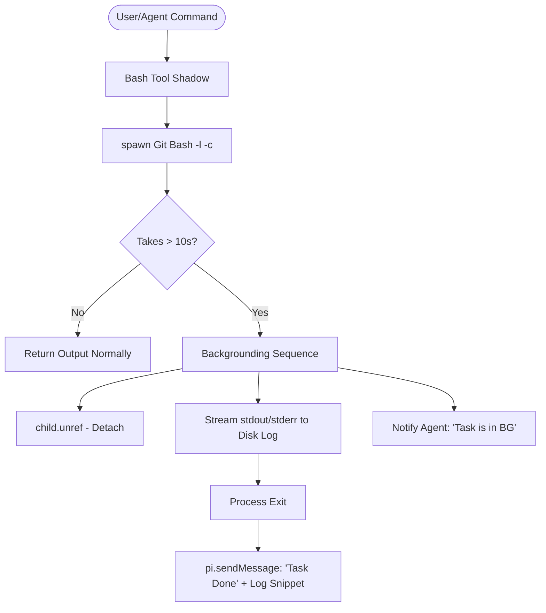

# Project Context: pi-bg-process-windows

**Status:** v2.0 Core Complete & Codified  
**Last Updated:** 2026-04-13  
**Created By:** Antigravity (Advanced Agentic Coding Agent)  
**Purpose:** Robust auto-backgrounding for PI Coding Agent on Windows

---

## Executive Summary

This extension shadows the built-in `bash` tool on Windows to automatically background long-running commands (default >10s). It prevents the agent's UI from freezing during heavy tasks like builds or installs.

- **Current Architecture:** v2.0 (Automated).
- **Primary Mechanism:** `child.unref()` for process detachment + disk-based output streaming.
- **Handoff Status:** Core logic is stable and documented. The documentation maintenance rules are codified in `AGENTS.md`.

---

## What This Project Is (v2.0)

### The Problem
On Windows, the PI Agent's `bash` tool is synchronous and blocking. If a command takes 5 minutes (like a `cmake` build), the agent is effectively "dead" until it finishes. There is no native `tmux` or `screen` that works reliably in this context without complex setup.

### The Solution
A "shadow" extension that:
1.  **Intercepts** all calls to the standard `bash` tool.
2.  **Monitors** execution. If it exceeds 10s, it backgrounds the process.
3.  **Detaches** the process so the agent can return control to the user.
4.  **Streams** subsequent output to a log file in `%TEMP%\pi-bg`.
5.  **Auto-notifies** the LLM via `pi.sendMessage` once the task is done.

---

## Architecture Overview (v2.0)

### Data Flow

### Key Components
- **`src/index.ts`**: Contains the `executeWithTimeout` core logic.
- **Process Tree Cleanup**: Uses `SIGKILL` for immediate parent death and PowerShell's `Get-CimInstance` to hunt down orphaned children (workaround for `taskkill` hangs).
- **Management Tools**: 
    - `win_bg_status` (LLM-only): List, view logs, or stop BG tasks.
    - `/win_tasks` (User-only): Command-line management of tasks.

---

## Current Implementation State

### Completed Tasks ✅
- [x] **v2.0 Architecture**: Switched from manual Ctrl+B to automated 10s backgrounding.
- [x] **Process Resilience**: Implemented `SIGKILL` + PS orphan cleanup to prevent agent hangs.
- [x] **Memory Safety**: Output is streamed to disk after backgrounding to handle large logs.
- [x] **Agent SOP**: `AGENTS.md` updated with strict documentation and technical rules.
- [x] **Knowledge Base**: `LEARNINGS.md` and `PROJECT.md` populated with design rationale.

### Pending / Planned 🔧
- [ ] **Cleanup Policy**: Automatically delete log files in `%TEMP%\pi-bg` after 24 hours.
- [ ] **Configurability**: Add environment variables to customize the 10s timeout.
- [ ] **Integration Tests**: Run the extension in a live PI session with a massive build (e.g., `llama.cpp`).

---

## Evolution & History

### v1.0: The "Manual Migration" Approach (2026-04-03)
The original goal was to mirror Claude Code's "Ctrl+B" behavior exactly.

#### v1.0 Architecture (Archived)
1. **Tool:** Synchronous `bash` tool.
2. **UI:** Used `ctx.ui.custom()` to create a TUI monitor.
3. **Trigger:** Intercepted keyboard input (`\x02`) for Ctrl+B.
4. **Migration:** When Ctrl+B was pressed, the extension would:
   - Kill the foreground process.
   - Spawn a **PowerShell Start-Job**.
   - Transfer captured output to the job's log.
5. **Timeout:** Auto-backgrounded after 300s (5 minutes).

#### Why we moved away from v1.0 to v2.0:
- **Complexity:** The TUI component and keyboard interception were fragile in some terminal environments.
- **Restart Latency:** The kill-and-respawn migration meant long commands restarted from zero when backgrounded.
- **PowerShell Jobs:** `Start-Job` was sometimes less reliable for streaming real-time logs than direct Node/Bun `child.unref()`.

---

## Handoff Instructions

**For the Next Agent:**
1.  **Read `AGENTS.md` first.** It contains the "Critical Rules" (especially the `taskkill` and `BashResult` traps).
2.  **Verify `src/index.ts`.** All core logic is there.
3.  **Run `bun run test`.** Ensure the standalone test harness still passes (covers process kill, timeout, and result shapes).
4.  **Next Objective:** Implement the "Cleanup Policy" to prevent log accumulation in the temp directory.

---

## Changelog

### 2026-04-13 (v2.0 Rewrite Refinement)
- Formally retired the v1.0 "Ctrl+B / PowerShell Jobs" architecture.
- Codified documentation maintenance rules in `AGENTS.md`.
- Updated `.project-context.md` (this file) to perfectly reflect the v2.0 reality.
- Synced all documentation files (`LEARNINGS.md`, `PROJECT.md`, `AGENTS.md`).

---

**End of Context**
